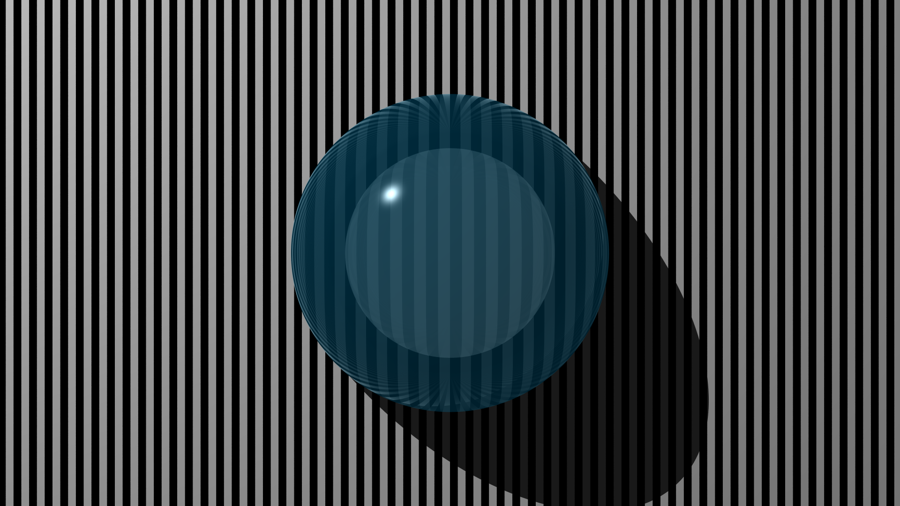
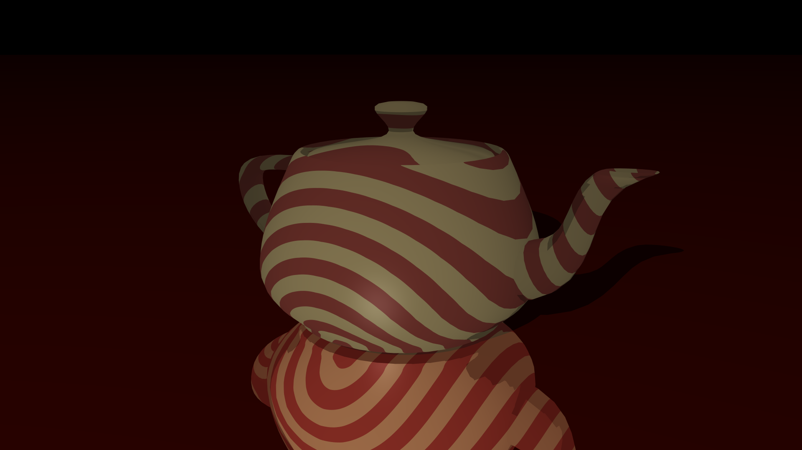

# Ectert Raytracer

Ectert is a software raytracer written in C++.
It's initial design is inspired by Jamis Buck's _The Raytracer Challenge_, but it will diverge
as more features are added.

Here are some examples of the kinds of images it's currently capable of producing:

Model credit [University of Utah](https://graphics.cs.utah.edu/courses/cs6620/fall2013/?prj=5).

The project uses CMake for building and Google Test for unit tests. It is currently incompatible with MSVC,
but should compile under most distributions of GCC. (It's usually tested with MinGW)

Current features include:
- Blinn-Phong lighting materials
- Basic shadows
- Reflection and refraction
- Patterned textures
- Multi-sample anti-aliasing
- Multi-threaded CPU rendering

Potential future additions include:
- Global illumination
- PBR materials
- Texture mapping
- GPU compute rendering

And many other interesting rendering techniques
